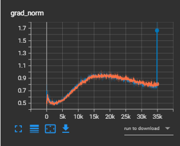
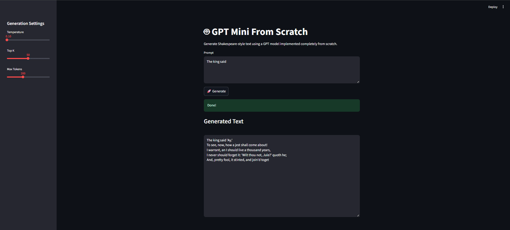
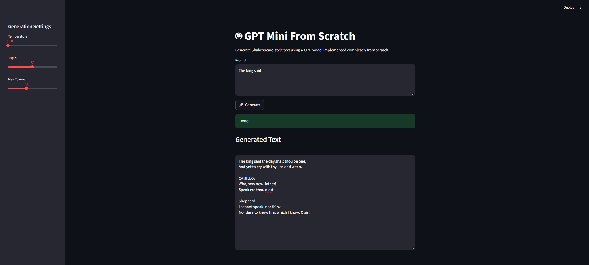

# GPT Mini From Scratch

A complete decoder-only GPT implementation built entirely from scratch using **PyTorch**, without relying on `nn.Transformer`. This project recreates the core building blocks behind GPT-style language models, including Multi-Head Self-Attention, Layer Normalization, Feed Forward Networks, causal masking, and autoregressive text generation.

The model is trained on the **Tiny Shakespeare** dataset using character-level language modeling.

---

## Features

- Decoder-only GPT architecture
- Multi-Head Self-Attention implemented from scratch
- Custom Layer Normalization
- Feed Forward Network with GELU activation
- Learnable Positional Embeddings
- Causal (Look-Ahead) Mask
- Padding Mask support
- Residual Connections
- Dropout Regularization
- Final Layer Normalization
- Character-level Tokenizer
- Tiny Shakespeare Dataset Loader
- Custom Training Loop
- TensorBoard Logging
- Gradient Clipping
- Model Checkpoint Saving & Loading
- Temperature Sampling
- Top-K Sampling
- Streamlit Demo

---

# Project Structure

```text
GPT-Mini-From-Scratch/
│
├── assets/
│   ├── Demo/
│   │   ├── without_gaussian_noise.png
│   │   └── with_gaussian_noise.png
│   │
│   └── Tensorboard/
│       ├── Loss curve.png
│       └── Gradiant.png
│
├── src/
│   ├── mha.py
│   ├── layernorm.py
│   ├── feedforward.py
│   ├── decoderblock.py
│   └── model.py
│
├── dataset.py
├── trainer.py
├── generation.py
├── app.py
├── train.py
├── requirements.txt
└── README.md
```

---

# Model Architecture

```text
Input Tokens
      │
      ▼
Token Embedding
      │
      ▼
Learnable Positional Embedding
      │
      ▼
N × Decoder Blocks
      │
      ├── LayerNorm
      ├── Masked Multi-Head Self-Attention
      ├── Residual Connection
      ├── LayerNorm
      ├── Feed Forward Network
      └── Residual Connection
      │
      ▼
Final LayerNorm
      │
      ▼
Linear Projection
      │
      ▼
Vocabulary Logits
```

---

# Model Configuration

The main GPT Mini configuration used in the training and generation setup is:

| Parameter | Value |
|-----------|------:|
| Embedding Dimension | 512 |
| Attention Heads | 8 |
| Decoder Layers | 5 |
| Feed Forward Scale Factor | 4 |
| Sequence Length | 128 |
| Tokenization | Character-level |
| Dataset | Tiny Shakespeare |

---

# Training

The model is trained using **next-character prediction**.

Example

```text
Input :
To be or n

Target:
To be or not
```

Loss Function

- CrossEntropyLoss

Optimizer

- AdamW

Additional Features

- Gradient Clipping
- TensorBoard Logging
- Automatic Checkpoint Saving

---

# TensorBoard

### Loss Curve


The training loss decreases smoothly throughout training, indicating stable optimization without divergence.

---

### Gradient Norm



Gradient clipping keeps the optimization stable while preventing exploding gradients.

---

# Gaussian Noise Experiment

As an additional experiment, Gaussian noise was injected into the token embeddings during training to investigate its effect on the model's training behavior and generated text.

The experiment compares the baseline model against a model trained with Gaussian noise applied to the token embeddings.

## Without Gaussian Noise



Example Output

```text
The king said 'Ay.'
To see, now, how a jest shall come about!
I warrant, an I should live a thousand years,
I never should forget it...
```

---

## With Gaussian Noise



Example Output

```text
The king said the day shalt thou be one,
And yet to cry with thy lips and weep.

CAMILLO:
Why, how now, father!
Speak ere thou diest.
```

### Quantitative Result

| Experiment | Average Loss |
|------------|-------------:|
| Without Gaussian Noise | **0.6499** |
| With Gaussian Noise | **0.6348** |

The Gaussian-noise experiment achieved an average loss reduction of **0.0151 (2.32%)** compared with the baseline in this training run.

### Observation

Both models successfully learn the Shakespeare writing style.

The Gaussian Noise version produced a slightly lower average training loss in this experiment. The qualitative generation examples also show variation between the two runs; however, generation quality was not evaluated with a dedicated quantitative text-generation metric, so the experiment is presented as an exploratory regularization study rather than a definitive improvement.

---

# Streamlit Demo

The project includes a simple Streamlit interface for interactive text generation.

Features

- Prompt Input
- Temperature Control
- Top-K Sampling
- Max Token Selection
- Real-time Generation

Run

```bash
streamlit run app.py
```

---

# Installation

```bash
git clone https://github.com/ziadTeama-dev/gpt-mini-from-scratch.git

cd gpt-mini-from-scratch

pip install -r requirements.txt
```

---

# Training

```bash
python train.py
```

Launch TensorBoard

```bash
tensorboard --logdir Logs
```

---

# Technologies

- Python
- PyTorch
- TensorBoard
- Streamlit
- tqdm

---

# Future Improvements

- Byte Pair Encoding (BPE)
- Mixed Precision Training (AMP)
- Learning Rate Scheduler
- Weight Tying
- Flash Attention
- Rotary Positional Embeddings (RoPE)
- KV Cache
- Top-P Sampling
- Beam Search
- GPT-2 Compatible Tokenizer
- Larger Datasets
- Hugging Face Export

---

# License

Released under the MIT License.

# Author 

Ziad AbdelHalim teama
